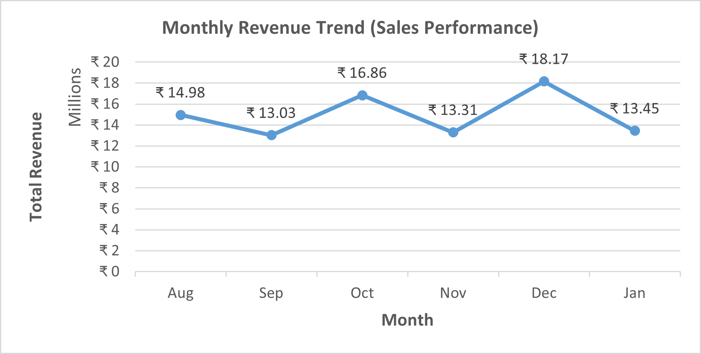

# Logistics Operations Analytics Project

## Project Overview

This is an end-to-end Logistics and Operations Analytics project demonstrating the complete data analysis workflow from data generation to business dashboard reporting.

The project simulates a real-world logistics business environment with customers, orders, products, shipments, and delivery performance.

This project demonstrates skills required for:

- Data Analyst roles
- Operations Analyst roles
- Remote analytics jobs
- Freelance analytics projects

---

## Tools and Technologies Used

- Python – Data generation
- MySQL – Database design and SQL analysis
- Excel – Dashboard creation and business reporting
- GitHub – Project documentation and portfolio

---

## Project Workflow

1. Generated realistic logistics dataset using Python
2. Designed relational database in MySQL
3. Performed SQL analysis to answer business questions
4. Connected SQL database to Excel
5. Built interactive dashboard and visualizations
6. Published project on GitHub for portfolio

---

## Python Data Generation

This script generates realistic logistics data including customers, products, orders, and shipments.

---

## SQL Analysis in MySQL Workbench

SQL was used to analyze revenue, delivery performance, customer insights, and operational KPIs.

---

## Dashboard and Business Insights

### Monthly Revenue Trend

Shows revenue performance across months.

---

### Revenue by Product Category

Shows which product categories generate highest revenue.

---

### Order Status Distribution

Shows operational order fulfillment performance.

---

## Business Problems Solved

- Total revenue analysis
- Monthly sales trend analysis
- Top customers analysis
- Product performance analysis
- Category performance analysis
- Delivery time performance
- Late delivery analysis
- Order status tracking
- Operational KPI reporting

---

## Key Skills Demonstrated

- Python data generation
- SQL joins and aggregations
- Advanced SQL (CTE, window functions, procedures)
- Relational database design
- Data quality validation
- Excel dashboard development
- Business KPI analysis
- Operations analytics

---

## Project Outcome

This project demonstrates complete real-world analytics workflow used by professional data analysts and operations analysts.

---

## Author

Umesh Zampadiya  
Operations Analyst  
GitHub: https://github.com/lonianverse
https://www.linkedin.com/in/umeshzampadiya/
