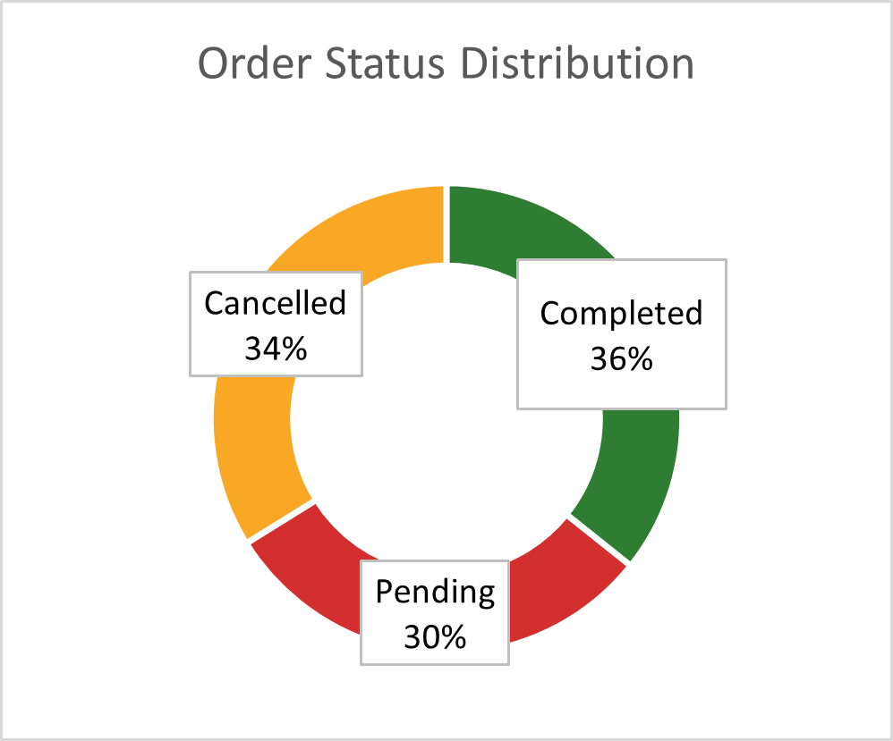
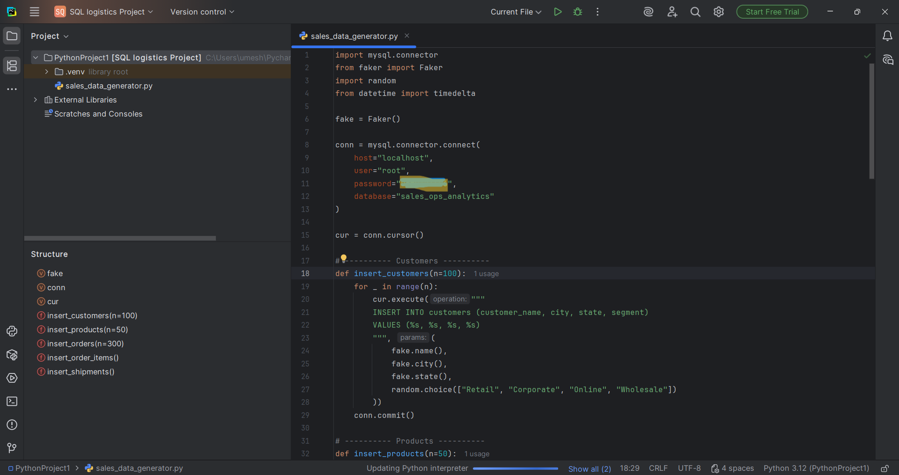
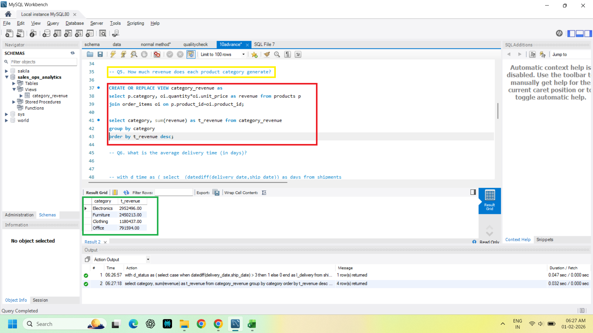

# Logistics Operations Analytics Project

## Executive Summary

This project demonstrates a complete end-to-end logistics and operations analytics workflow. It simulates a real-world logistics environment and provides business insights into revenue, customer performance, product trends, and delivery operations.

The project covers the full analytics pipeline including data generation, database design, SQL analysis, and dashboard reporting.

This project demonstrates practical skills required for Data Analyst and Operations Analyst roles.

---

## Dashboard Preview

The Excel dashboard provides visual insights into business performance.



---

## Business Objective

The objective of this project is to analyze logistics operations data and generate actionable insights to support business decision-making.

Key focus areas:

- Revenue performance analysis
- Customer and product performance analysis
- Delivery efficiency and operations performance
- Order fulfillment tracking
- KPI dashboard reporting

---

## Tools and Technologies

| Tool | Purpose |
|-----|--------|
| Python | Generate realistic logistics dataset |
| MySQL | Database creation and SQL analysis |
| Excel | Dashboard creation and visualization |
| GitHub | Project documentation and portfolio |

---

## Project Architecture

Python → MySQL Database → SQL Analysis → Excel Dashboard → Business Insights

---

## Repository Structure

```
logistics-operations-analytics-project/
│
├── logistics_data_generator.py
├── logistics_analysis_queries.sql
├── logistics_operations_dataset.csv
├── Sales_Operations_Analytics_Dashboard.xlsx
│
├── images/
│   ├── Python_script.png
│   ├── SQL_query.png
│   ├── Monthly_revenue_trend.png
│   ├── Revenue vs Delivery Time Trend.png
│   └── Order_Status_Distribution.png
│
└── README.md
```

---

## How to Run This Project

Follow these steps to reproduce the project:

Step 1: Run the Python script  
Run `logistics_data_generator.py` to generate and insert logistics data into MySQL database.

Step 2: Set up the database  
Open MySQL Workbench and run `logistics_analysis_queries.sql` to create tables and perform analysis.

Step 3: Execute SQL queries  
Run the queries in `logistics_analysis_queries.sql` to generate business insights such as revenue, product performance, and delivery metrics.

Step 4: Open Excel dashboard  
Open `Sales_Operations_Analytics_Dashboard.xlsx` and refresh the data to view the dashboard and visual insights.

Final Result:  
Complete analytics workflow from Python data generation → SQL analysis → Excel dashboard insights.

---

## Database Structure

The relational database consists of the following tables:

- customers
- products
- orders
- order_items
- shipments

This structure reflects real-world logistics database design.

---

## Key Business Questions Answered

1. What is the total revenue?
2. What is the monthly revenue trend?
3. Which customers generate the most revenue?
4. Which products sell the most?
5. What is the revenue by product category?
6. What is the average delivery time?
7. What percentage of deliveries are late?
8. What is the order status distribution?
9. Which orders have the longest delivery delays?
10. How does delivery performance impact revenue?

---

## Python Data Generation

The dataset was generated using Python to simulate real-world logistics operations.



---

## SQL Analysis

SQL was used to analyze business performance and generate KPIs.

Key SQL concepts used:

- Joins
- Aggregations
- Group By
- Common Table Expressions (CTE)
- Window Functions
- Views
- Stored Procedures



---

## Key Insights

- Identified revenue trends and seasonal performance
- Identified top-performing customers and products
- Analyzed delivery efficiency and operational performance
- Measured late delivery percentage
- Built operational KPI dashboard

---

## Project Files

| File | Description |
|----|-------------|
| logistics_data_generator.py | Python script for data generation |
| logistics_analysis_queries.sql | SQL queries for analysis |
| logistics_operations_dataset.csv | Final dataset |
| Sales_Operations_Analytics_Dashboard.xlsx | Excel dashboard |
| images/ | Project screenshots |

---

## Skills Demonstrated

- Data Analysis
- SQL
- Python
- Database Design
- Excel Dashboarding
- Operations Analytics
- Business Intelligence
- Data Visualization

---

## Real-World Relevance

This project reflects real-world logistics and operations analytics workflows used in companies for:

- Operations performance monitoring
- KPI reporting
- Business decision-making
- Logistics optimization

---

## Author

Umesh Zampadiya  
Operations Analyst | Aspiring Data Analyst  

GitHub: https://github.com/Ionianverse  
LinkedIn: https://www.linkedin.com/in/umeshzampadiya/

---
